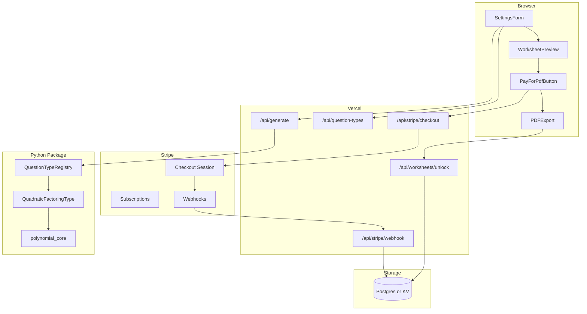
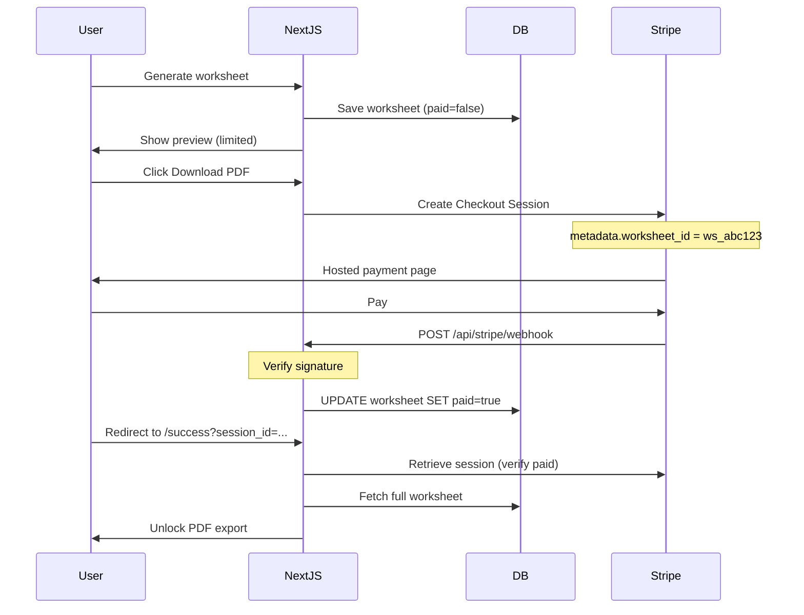

# Math Worksheet Generator — Architecture Plan

## Goal

Turn the existing [`polynomial.py`](polynomial.py) library into a **web-hostable math worksheet generator** with:

- Extensible `Question` / `QuestionType` domain model
- Settings UI driven by each type's config schema
- Client-side PDF export
- Optional Stripe monetization (pay-per-PDF and/or subscription)
- **MVP topic:** quadratic factoring
- **Hosting:** Vercel or Netlify (serverless)

---

## Architecture Overview



| Layer | Tech | Why |
|-------|------|-----|
| Frontend + API routes | Next.js 14+ (App Router) | One deploy on Vercel; shared origin for API + UI |
| Generation | Python 3.11+ package | Reuse existing `Polynomial` logic |
| Payments | Stripe Checkout + Webhooks | Industry standard; works on serverless |
| Persistence | Vercel Postgres, Supabase, or Upstash Redis | Track paid worksheets and subscriptions |
| PDF | KaTeX + `window.print()` / `html2pdf.js` | No LaTeX compiler on serverless |
| Sympy | Not in MVP path | Only used in `PFD()`; quadratic factoring doesn't need it |

---

## Project Structure

```
Polynomial/
├── packages/
│   └── polynomial_core/          # Extracted from polynomial.py
│       ├── __init__.py
│       └── polynomial.py
│
├── question_engine/              # Python question framework
│   ├── models.py                 # Question, QuestionSet, SettingField
│   ├── base.py                   # QuestionType ABC + registry
│   ├── types/
│   │   └── quadratic_factoring.py
│   └── api_handler.py
│
├── web/                          # Next.js app
│   ├── app/
│   │   ├── page.tsx
│   │   ├── success/page.tsx      # Stripe return URL
│   │   ├── cancel/page.tsx
│   │   └── api/
│   │       ├── generate/route.ts
│   │       ├── question-types/route.ts
│   │       ├── stripe/
│   │       │   ├── checkout/route.ts
│   │       │   └── webhook/route.ts
│   │       └── worksheets/
│   │           ├── route.ts      # Create worksheet session
│   │           └── unlock/route.ts
│   ├── components/
│   │   ├── SettingsForm.tsx
│   │   ├── WorksheetPreview.tsx
│   │   ├── ExportPdfButton.tsx
│   │   └── PayForPdfButton.tsx
│   ├── lib/
│   │   ├── api.ts
│   │   ├── stripe.ts
│   │   └── db.ts
│   └── package.json
│
├── prisma/ or db/                # Schema + migrations (if using Postgres)
├── requirements.txt
├── vercel.json
└── ARCHITECTURE.md
```

---

## Core Domain Model (Python)

### `Question`

```python
@dataclass
class Question:
    id: str
    topic: str
    prompt_latex: str
    prompt_text: str
    answer_latex: str | None
    metadata: dict
```

### `QuestionType` (registry pattern)

```python
class QuestionType(ABC):
    id: str
    name: str
    description: str

    @abstractmethod
    def settings_schema(self) -> list[SettingField]: ...

    @abstractmethod
    def generate(self, settings: dict) -> list[Question]: ...
```

New topics = new subclass + register. No API or UI framework changes required.

### MVP: `QuadraticFactoringQuestionType`

Wraps `Polynomial.quadraticFactoringQuestions()` (lines 517–524 in `polynomial.py`).

**Settings:**

| Field | Type | Default | Maps to |
|-------|------|---------|---------|
| `count` | int | 10 | `num` |
| `c_min`, `c_max` | int | -10, 10 | `cCoefficients` |
| `a_min`, `a_max` | int | 1, 1 | `aCoefficients` |
| `include_answer_key` | bool | false | `answer_latex` population |

---

## API Design

### `GET /api/question-types`

Returns registered types and settings schemas for dynamic form rendering.

### `POST /api/generate`

Generates questions. Returns worksheet JSON (preview-safe: can omit answer key until paid).

### `POST /api/worksheets`

Creates a persisted worksheet session before payment.

**Request:**
```json
{
  "type_id": "quadratic_factoring",
  "settings": { "count": 12, "c_min": -10, "c_max": 10 },
  "title": "Factoring Practice"
}
```

**Response:**
```json
{
  "worksheet_id": "ws_abc123",
  "preview": {
    "title": "Factoring Practice",
    "questions": [
      { "id": "q1", "prompt_latex": "\\text{Factor: } 2x^{2}+5x-3" }
    ]
  },
  "paid": false
}
```

---

## Stripe Integration

Stripe works fully with this serverless stack. Payment gates **access to export**, not PDF generation itself.

### Monetization models

#### Option A — Pay per PDF (recommended MVP)

Best for: occasional teachers, portfolio demo, low friction.

| Tier | What user gets |
|------|----------------|
| Free | Preview worksheet (watermarked or first 3 questions) |
| Paid ($2–5) | Full worksheet + answer key + clean PDF export |

**Flow:**
1. User configures settings and generates preview
2. App saves worksheet to DB with `paid: false`
3. User clicks "Download PDF — $3"
4. App creates Stripe Checkout Session with `worksheet_id` in metadata
5. User pays on Stripe-hosted page
6. Stripe webhook marks worksheet `paid: true`
7. User returns to `/success?session_id=...`
8. App verifies payment, unlocks full data + PDF export

#### Option B — Subscription (Phase 2)

Best for: repeat customers (teachers generating weekly worksheets).

| Tier | Price | Features |
|------|-------|----------|
| Free | $0 | 1 worksheet/day, watermarked |
| Pro | $9/mo | Unlimited PDFs, answer keys, saved presets |
| School | $29/mo | Multiple users (future) |

Uses Stripe Billing (`customer`, `subscription`, `checkout` in `mode: subscription`).

Webhook events: `checkout.session.completed`, `customer.subscription.updated`, `customer.subscription.deleted`.

#### Recommendation

Start with **pay-per-PDF**. Add subscription once you have repeat usage signal.

---

### Stripe payment flow



---

### New API routes

#### `POST /api/stripe/checkout`

Creates a Stripe Checkout Session.

```typescript
// web/app/api/stripe/checkout/route.ts
const session = await stripe.checkout.sessions.create({
  mode: 'payment',  // or 'subscription' for Option B
  line_items: [{
    price: process.env.STRIPE_PRICE_ID,  // e.g. price_xxx for $3 PDF
    quantity: 1,
  }],
  metadata: { worksheet_id: worksheetId },
  success_url: `${origin}/success?session_id={CHECKOUT_SESSION_ID}`,
  cancel_url: `${origin}/cancel?worksheet_id=${worksheetId}`,
});
return { url: session.url };
```

#### `POST /api/stripe/webhook`

**Critical:** Must verify Stripe signature. Never trust client-side "I paid" flags.

```typescript
// web/app/api/stripe/webhook/route.ts
const event = stripe.webhooks.constructEvent(body, sig, webhookSecret);

if (event.type === 'checkout.session.completed') {
  const session = event.data.object;
  const worksheetId = session.metadata.worksheet_id;
  await db.worksheet.update({
    where: { id: worksheetId },
    data: { paid: true, stripe_session_id: session.id },
  });
}
```

#### `GET /api/worksheets/unlock?worksheet_id=...&session_id=...`

Called after redirect to success page. Double-checks payment before returning full worksheet (including answer key).

```typescript
const session = await stripe.checkout.sessions.retrieve(sessionId);
if (session.payment_status !== 'paid') return 403;
const worksheet = await db.worksheet.findUnique({ where: { id: worksheetId } });
if (!worksheet.paid) return 403;
return worksheet.full_data;  // includes answer_latex
```

---

### Minimal database schema

Use **Vercel Postgres + Prisma** or **Supabase** (both deploy cleanly alongside Vercel).

```prisma
model Worksheet {
  id              String   @id @default(cuid())
  created_at      DateTime @default(now())
  type_id         String
  title           String
  settings        Json
  preview_data    Json     // questions without answer key
  full_data       Json     // questions with answer key
  paid            Boolean  @default(false)
  stripe_session_id String?
  user_email      String?  // from Stripe checkout
}

model Subscription {
  id                   String   @id @default(cuid())
  stripe_customer_id   String   @unique
  stripe_subscription_id String @unique
  status               String   // active, canceled, past_due
  current_period_end   DateTime
  user_email           String
}
```

**KV alternative (lighter MVP):** Upstash Redis with keys `worksheet:{id}` → JSON blob. Fine for pay-per-PDF without user accounts.

---

### Environment variables (Vercel)

```
STRIPE_SECRET_KEY=sk_live_...
STRIPE_WEBHOOK_SECRET=whsec_...
STRIPE_PRICE_ID=price_...          # pay-per-PDF price
STRIPE_SUBSCRIPTION_PRICE_ID=price_...  # optional, Phase 2
NEXT_PUBLIC_STRIPE_PUBLISHABLE_KEY=pk_live_...
DATABASE_URL=postgres://...
```

---

### Security rules

| Rule | Why |
|------|-----|
| Never expose `answer_latex` before payment | Client can inspect network tab |
| Webhook must verify `stripe-signature` | Prevents fake payment events |
| Store `worksheet_id` in Checkout metadata, not URL alone | Tamper resistance |
| Success page re-verifies with Stripe API | Webhook may arrive after redirect |
| Signed export tokens optional | `jwt.sign({ worksheetId, paid }, secret, { expiresIn: '1h' })` |

**Free preview strategy:**
- Return only `prompt_latex` (no answers)
- Watermark preview with "PREVIEW — Purchase to download"
- Or cap free preview to first N questions

---

### Frontend components

#### `PayForPdfButton.tsx`

```tsx
// Disabled until worksheet is generated
// On click: POST /api/stripe/checkout → redirect to session.url
// After success page: enable ExportPdfButton
```

#### `ExportPdfButton.tsx`

```tsx
// Calls GET /api/worksheets/unlock
// If 403: show "Payment required"
// If 200: render full worksheet + trigger print/html2pdf
```

#### `/success/page.tsx`

```tsx
// Read session_id from query
// Poll /api/worksheets/unlock until paid (webhook may lag ~1-2s)
// Show "Download your PDF" when unlocked
```

---

### Stripe setup checklist

1. Create Stripe account → get test keys
2. Create Product: "Math Worksheet PDF"
3. Create Price: $3.00 one-time (`price_xxx`)
4. Install `stripe` npm package in `web/`
5. Add webhook endpoint in Stripe Dashboard: `https://yourdomain.com/api/stripe/webhook`
6. Subscribe to events: `checkout.session.completed`
7. Test with card `4242 4242 4242 4242`
8. Switch to live keys for production

---

## PDF Export (unchanged)

PDF stays **client-side** — Stripe doesn't change this.

1. KaTeX renders `prompt_latex` in browser
2. `window.print()` or `html2pdf.js` for download
3. Payment only unlocks the full worksheet data needed to render

---

## Phased Rollout

### Phase 1 — MVP (no payments)
- [ ] Extract `polynomial_core`; remove import side effects
- [ ] `Question` / `QuestionType` / registry
- [ ] `QuadraticFactoringQuestionType`
- [ ] Generate + preview API
- [ ] Settings form + KaTeX preview
- [ ] Browser print-to-PDF (free for all)
- [ ] Deploy to Vercel

### Phase 2 — Stripe pay-per-PDF
- [ ] Add Postgres or Redis
- [ ] `POST /api/worksheets` (persist session)
- [ ] Stripe Checkout + webhook
- [ ] `/success` and `/cancel` pages
- [ ] Gated answer key + clean PDF export
- [ ] Watermarked free preview

### Phase 3 — Polish + subscription
- [ ] Stripe Billing for monthly Pro tier
- [ ] Saved presets (localStorage or DB)
- [ ] Worksheet title, name line, layout options
- [ ] `html2pdf.js` one-click download

### Phase 4 — More question types
| Type | Existing method |
|------|-----------------|
| Polynomial factoring (RRT) | `Polynomial.rrt()` |
| Rational addition | `createRationalAdditionProblemWithOneCancellation()` |
| Difference tables | `differences()` |
| Cosine identities | `productOfCosineDoubleAngles()` |

---

## Dependencies

**MVP Python (`requirements.txt`):**
```
# No third-party deps for quadratic factoring
```

**Web (`package.json`):**
```json
{
  "dependencies": {
    "next": "^14",
    "react": "^18",
    "katex": "^0.16",
    "react-katex": "^3",
    "stripe": "^14",
    "@prisma/client": "^5"
  }
}
```

---

## Risks and Mitigations

| Risk | Mitigation |
|------|------------|
| Python cold starts | Keep bundle tiny; cache question-type schema |
| Webhook arrives after redirect | Success page polls unlock endpoint |
| User bypasses pay button | Server never sends `full_data` until webhook confirms |
| Stripe test vs live confusion | Separate env vars per Vercel environment |
| `factor()` unreliable for high degree | MVP uses quadratics with known integer factors |

---

## Portfolio talking points

When presenting this project:

- **Architecture:** Registry-based question types, schema-driven UI, separation of generation/payment/export
- **Payments:** Stripe Checkout + webhook verification (not client-trust)
- **Serverless:** Python generation + Next.js API routes on Vercel
- **Tradeoffs:** Client-side PDF to avoid LaTeX on serverless; paywall on data not rendering
- **Extensibility:** New question type = one Python file, zero API changes
