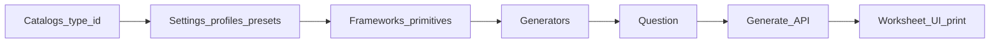
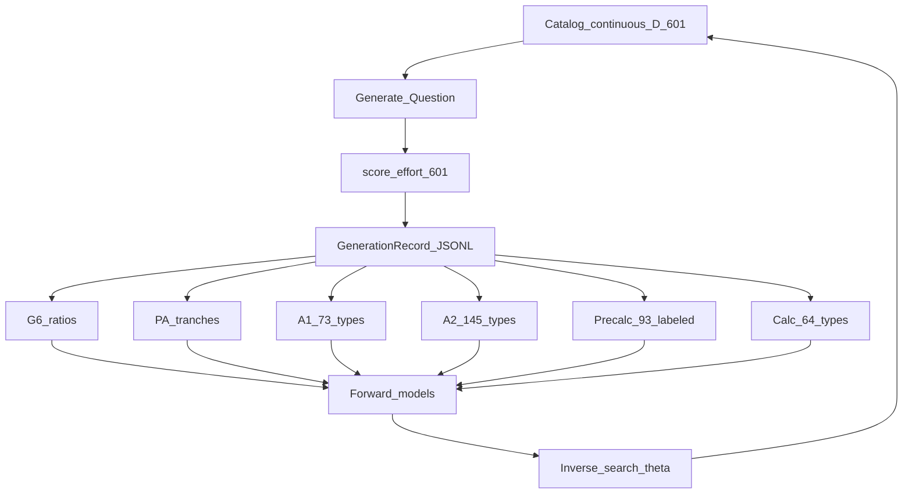
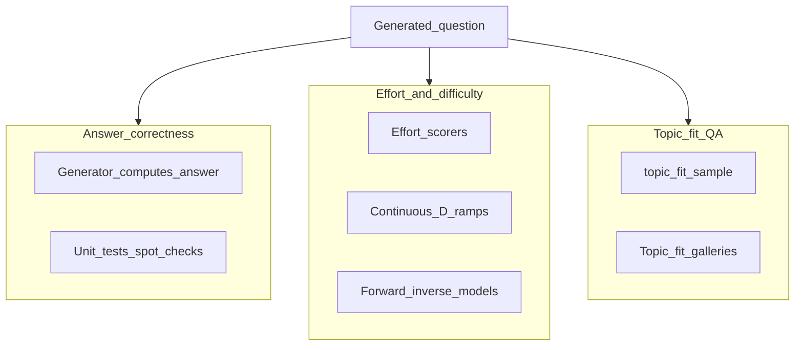
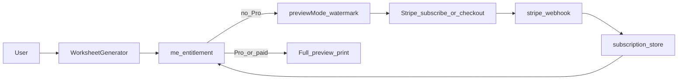

# Math Worksheet Generator

Generate printable math worksheets (Grade 6 → Calculus) from a Python question engine, with continuous difficulty, KaTeX preview, Auth.js + Stripe gating, and a difficulty-learning loop (effort scorers → GenerationRecord → forward/inverse models).

**Effort scorers:** all **601** continuous-D catalog types are scored (**0** remaining) — see [`UNSCORED_EFFORT.md`](scripts/output/ml/UNSCORED_EFFORT.md).

## Table of contents

1. [Feature inventory](#feature-inventory)
2. [What has been mined / created](#what-has-been-mined--created)
3. [Architecture](#architecture)
4. [How to run](#how-to-run)
5. [Status by course](#status-by-course)
6. [Project layout](#project-layout)
7. [Local development](#local-development)
8. [Deploy to Vercel](#deploy-to-vercel)
9. [Further reading](#further-reading)

---

## Feature inventory

Verified against the repo (paths exist unless noted).

### Product / UI

| Feature | Where | Notes |
|---------|-------|-------|
| Worksheet generator UI | `components/WorksheetGenerator.tsx` | Topic sections, settings, generate, preview |
| Interactive KaTeX preview | `components/InteractiveWorksheet.tsx` | Answer key, print |
| Schema-driven settings | question-type schemas via `/api/question-types` | Continuous `difficulty` slider when present |
| Browser print-to-PDF | print CSS in `app/globals.css` | No server-side LaTeX |
| Curriculum browser | `lib/curriculum.ts` | Course → chapter → leaf `type_id`s |
| **Topic display labels** | `lib/topic-labels.ts`, `question_engine/topic_labels.py` | UI / INDEX / galleries show `g6:` `pa:` `a1:` `ge:` `a2:` `pc:` `c1`/`c2`/`c3:` + human name (type_ids unchanged) |
| **Progressive worksheets** | `lib/progressive.ts`, `question_engine/progressive.py`, API `progressive` body | Seed topic(s) + D ramp across related continuous-D types |
| **Worksheet difficulty** | `lib/worksheet-difficulty.ts`, `question_engine/worksheet_difficulty.py`, `config/worksheet-gallery.json` `difficulty_mapping` | Level 0–4 (D 0–3 / 0–8 / 3–20 / 8–25 / 20–25) or 0–24 slider → progressive `d_min`–`d_max` + schedule |
| **Worksheet gallery** | `app/gallery/`, `lib/worksheet-gallery.ts`, `config/worksheet-gallery.json` | `/gallery` — 10 progressive examples; rebuild via `scripts/build_worksheet_gallery.py` → `public/gallery/`, `scripts/output/worksheet_gallery/` |
| **Page fit / breaks** | `lib/worksheet-page-layout.ts`, `WorksheetPageLayout*.tsx` | Target page count, space/font/gap scales, optional page-break guides |
| **Preview watermark** | `components/WorksheetWatermark.tsx` | Shown when payment gate is active (`previewMode`) |
| Auth (Google OAuth) | `auth.ts`, `app/api/auth/[...nextauth]/route.ts`, `components/AuthControls.tsx`, `app/signin/page.tsx` | Auth.js v5; optional until env configured |
| Entitlement / Pro gate | `app/api/me/entitlement/route.ts`, `lib/subscription-store.ts` | Session + subscription lookup |
| Stripe pay-per-PDF | `app/api/stripe/checkout/route.ts`, webhook, unlock | Checkout → unlock worksheet |
| Stripe subscription | `app/api/stripe/subscribe/route.ts`, `portal/route.ts`, `SubscribeButton.tsx` | Subscribe + customer portal |
| Payments config | `app/api/payments/config/route.ts`, `.env.example` | Prices / disabled flag |

### Question engine

| Feature | Where | Notes |
|---------|-------|-------|
| Catalogs G6 → Calc (+ Geometry) | `question_engine/catalogs/` | ~601 leaves: G6 88, PA 47, A1 86, A2 145, Geo 86, Precalc 94, Calc 64 |
| Settings / profiles / presets | `question_engine/settings/` | Domain profiles + enrichment; continuous D on all catalog rows |
| Frameworks + primitives | `question_engine/frameworks/` | Number, geometry, graphing, statistics, word problems, etc. |
| Generators | `question_engine/generators/` | Grade-level, advanced, calculus, misc, primitives |
| Question models + registry | `question_engine/models.py`, `core/`, `types/` | `Question` / typed leaves |
| Scaffold / readiness | `question_engine/scaffold.py`, `type_readiness.py` | Unwired / not-ready stubs |
| Diagrams + **figure families** | `question_engine/diagrams/`, `figure_families.py` | ~19 parameterized textbook figure kinds (not OpenStax bitmaps); see [`FIGURE_DIVERSITY.md`](scripts/output/ml/FIGURE_DIVERSITY.md) |
| Progressive plan API | `question_engine/api/handler.py` | `progressive` expand or `plan_only` |
| CLI | `python -m question_engine.cli` | `question-types`, `generate` |
| Dev API | `python -m question_engine.dev_server` | Port `5328` |

### Continuous difficulty & ML

| Feature | Where | Notes |
|---------|-------|-------|
| Continuous `difficulty` (schema) | profiles + enrichment | **601 / 601** catalog rows (incl. **94 PC + 64 Calc = 158**); see [full migration](scripts/output/ml/CONTINUOUS_D_FULL_MIGRATION.md). Listed A0–A3 coarse EMH generation cleared ([TODO](scripts/output/ml/CONTINUOUS_D_TODO.md)); A4 family deepening remains; **B UI EMH labels cleared** |
| Effort scorers | `question_engine/ml/effort.py`, **`effort_calc.py`**, `effort_geo.py` | **Done:** **601 / 601** catalog types scored (~611 registry incl. aliases); Precalc/Calc via `register_precalc_calc_scorers` |
| GenerationRecord schema | `question_engine/ml/schema.py` | Export row: θ, prompt/answer, `y_effort`, features |
| Dataset export | `scripts/export_generation_dataset.py` | `--g6-ratios`, `--pre-algebra`, `--algebra-1`, **`--precalculus`**, **`--calculus`**, typed lists |
| Forward model | `question_engine/ml/forward.py`, `scripts/train_forward_effort_model.py` | `f(θ) → y_effort`; G6/PA/A1/A2 + **`precalc_forward_effort_model`** (r≈0.94) + **`calc_forward_effort_model`** (r≈0.93); A2 r≈0.91 |
| Inverse θ | `question_engine/ml/inverse.py`, `scripts/optimize_inverse_difficulty.py` | Search θ for target effort (G6/PA/A2 pilots; PC/Calc inverse next) |
| Features | `question_engine/ml/features.py` | Structural / effort features |
| Topic-fit QA (separate) | `scripts/topic_fit_sample.py`, `.cursor/skills/topic-fit-qa/` | Skill/method appropriateness — not answer correctness |
| Difficulty TRACKING / tranche docs | `scripts/output/topic_fit/g6_difficulty/`, `pa_difficulty/`; `scripts/output/ml/*_TRANCHE.md` | G6/PA ramp TRACKING; Precalc/Calc spine docs |

### Correctness vs difficulty vs topic fit

These are **separate** concerns (see [diagram](#three-qa-concerns)):

| Concern | Meaning | Typical tools |
|---------|---------|----------------|
| **Answer correctness** | Prompt ↔ answer key is mathematically right | Generators compute answers; unit tests; manual spot-check |
| **Effort / difficulty** | How hard the item is (scorer / continuous D ladder) | `score_effort`, GenerationRecord, forward/inverse |
| **Topic-fit QA** | Right skill, method, within-topic band (not “is the answer right”) | `topic_fit_sample.py`, galleries under `scripts/output/topic_fit/` |

---

## What has been mined / created

### OpenStax stage-1 inventories

Local HTML under `textbooks/openstax/html/`. Outputs: `scripts/output/example_mining/<book>/stage1/` (JSON + MD per section + `INDEX.md`). Overview: [`scripts/output/example_mining/README.md`](scripts/output/example_mining/README.md).

| Book | Stage-1 sections | Inventoried items | INDEX |
|------|-----------------:|------------------:|------|
| `prealgebra-2e` | 20 | — | [INDEX](scripts/output/example_mining/prealgebra-2e/stage1/INDEX.md) |
| `elementary-algebra-2e` | 55 | — | [INDEX](scripts/output/example_mining/elementary-algebra-2e/stage1/INDEX.md) |
| `intermediate-algebra-2e` | 43 | — | [INDEX](scripts/output/example_mining/intermediate-algebra-2e/stage1/INDEX.md) |
| `precalculus-2e` | 27 | 2280 | [INDEX](scripts/output/example_mining/precalculus-2e/stage1/INDEX.md) |
| `calculus-volume-1` | 34 | 2150 | [INDEX](scripts/output/example_mining/calculus-volume-1/stage1/INDEX.md) |
| `calculus-volume-2` | 10 | 734 | [INDEX](scripts/output/example_mining/calculus-volume-2/stage1/INDEX.md) |
| `calculus-volume-3` | 6 | 457 | [INDEX](scripts/output/example_mining/calculus-volume-3/stage1/INDEX.md) |

**Precalc + Calc Vol 1–3:** 77 stage-1 sections · ~5621 inventoried items (spine mining complete).

**Progression graphs** (prereq DAG + reading order): `scripts/output/example_mining/progression/` (`full_spine`, `g6_prealg_alg1`, calculus presets). Topic picker index: `lib/data/prerequisite-index.json`.

Stage 2 (family tagging / EMH) is not started; Stage 3 progression exports exist for selected presets.

### ML artifacts (`scripts/output/ml/`)

| Artifact | Rough size | Notes |
|----------|------------|-------|
| `g6_ratios.jsonl` | ~990 rows, 11 types | Ratios/percents pilot |
| `pa_first_tranche.jsonl` | ~1.2k rows, 13 types | PA first continuous-D + scorers |
| `pa_expanded_tranche.jsonl` | ~3.0k rows, 33 types | Fractions + algebra tranche |
| `a1_labeled_tranche.jsonl` | **6570** rows, **73** types | A1 labeled (+ exp graph / solve-by-graphing / scatter / visualizing) |
| `a1_continuous_stub.jsonl` / `a1_ea2e_followup_smoke.jsonl` | ~0.4k / ~0.6k | Stub / EA2e follow-up smoke |
| `a2_labeled_tranche.jsonl` | **13050** rows, **145** types | A2 full-catalog labeled export (IA2e + gap-fill + poly theory / relations) |
| `precalc_labeled_tranche.jsonl` | **8370** rows, **93** types | PC labeled export (94th type `pc_vectors_diagrams` scored; optional re-export pending) |
| `calc_labeled_tranche.jsonl` | **5760** rows, **64** types | Full Calc catalog (limits → DE / volumes / FTC) |
| `forward_effort_model.{json,pkl}` | G6 ratios forward | |
| `pa_forward_effort_model.{json,pkl}` | PA forward | |
| `a1_forward_effort_model.{json,pkl}` (+ stub) | A1 forward | Pearson r ≈ **0.91** (RMSE ≈ 2.03); prior 69-type r≈0.93 |
| `a2_forward_effort_model.{json,pkl}` | A2 forward | Pearson r ≈ **0.91** (RMSE ≈ 1.97) |
| `precalc_forward_effort_model.{json,pkl}` | PC forward | Pearson r ≈ **0.94** (RMSE ≈ 1.13) |
| `calc_forward_effort_model.{json,pkl}` | Calc forward | Pearson r ≈ **0.93** (RMSE ≈ 1.22) |
| `a2_export_types.json` / `precalc_export_types.json` / `calc_export_types.json` | Type lists for `--algebra-2` / `--precalculus` / `--calculus` | |
| `inverse_difficulty.json`, `pa_inverse_difficulty.json`, `a2_inverse_difficulty.json` | Inverse ladders (G6/PA/A2; PC/Calc inverse next) | |

Tranche / migration docs (start here):

- [`PA_DIFFICULTY_TRANCHE.md`](scripts/output/ml/PA_DIFFICULTY_TRANCHE.md)
- [`A1_DIFFICULTY_ROADMAP.md`](scripts/output/ml/A1_DIFFICULTY_ROADMAP.md)
- [`A2_DIFFICULTY_TRANCHE.md`](scripts/output/ml/A2_DIFFICULTY_TRANCHE.md)
- [`PRECALC_DIFFICULTY_TRANCHE.md`](scripts/output/ml/PRECALC_DIFFICULTY_TRANCHE.md)
- [`CALC_DIFFICULTY_TRANCHE.md`](scripts/output/ml/CALC_DIFFICULTY_TRANCHE.md)
- [`CONTINUOUS_D_MIGRATION.md`](scripts/output/ml/CONTINUOUS_D_MIGRATION.md)
- [`CONTINUOUS_D_FULL_MIGRATION.md`](scripts/output/ml/CONTINUOUS_D_FULL_MIGRATION.md)
- [`PROGRESSIVE_WORKSHEET.md`](scripts/output/ml/PROGRESSIVE_WORKSHEET.md) — progressive practice mode notes
- [`UNSCORED_EFFORT.md`](scripts/output/ml/UNSCORED_EFFORT.md) — **complete:** **0** unscored / **601** scored
- [`FIGURE_DIVERSITY.md`](scripts/output/ml/FIGURE_DIVERSITY.md) — figure family registry

### Difficulty TRACKING

| Course | Path | Snapshot |
|--------|------|----------|
| Grade 6 | [`scripts/output/topic_fit/g6_difficulty/TRACKING.md`](scripts/output/topic_fit/g6_difficulty/TRACKING.md) | 78 Ready: 72 verified_ramp, 2 weak, 4 failed; catalog scorers complete |
| Pre-Algebra | [`scripts/output/topic_fit/pa_difficulty/TRACKING.md`](scripts/output/topic_fit/pa_difficulty/TRACKING.md) | 33 labeled types; markup/discount unblocked; catalog scorers complete |
| Algebra 1 | [`A1_DIFFICULTY_ROADMAP.md`](scripts/output/ml/A1_DIFFICULTY_ROADMAP.md) | **73** labeled types / 6570 rows; forward r≈0.91 (RMSE≈2.03); quad apps / higher roots still missing |
| Algebra 2 | [`A2_DIFFICULTY_TRANCHE.md`](scripts/output/ml/A2_DIFFICULTY_TRANCHE.md) | **145** labeled types; forward r≈0.91; inverse pilot (`a2_inverse_difficulty.json`) |
| Precalc | [`PRECALC_DIFFICULTY_TRANCHE.md`](scripts/output/ml/PRECALC_DIFFICULTY_TRANCHE.md) | **94/94** continuous + scored; labeled export **8370** / **93** types; forward r≈0.94 |
| Calc | [`CALC_DIFFICULTY_TRANCHE.md`](scripts/output/ml/CALC_DIFFICULTY_TRANCHE.md) | **64/64** continuous + scored; labeled **5760** / **64** types; forward r≈0.93 |

Topic-fit sample runs and audits also live under `scripts/output/topic_fit/` (many dated galleries / `*_audit` folders).

### Curriculum gaps

Living gap notes (missing / unwired / partial topics): [`scripts/output/curriculum_gaps/`](scripts/output/curriculum_gaps/README.md) — `grade_6.md`, `pre_algebra.md`, `algebra_1.md`, `algebra_2.md`, `precalculus.md`, `calculus.md`, plus `EXAMPLE_MINING.md` and `OPENSTAX_REORG.md`. UI/diagram deferrals: `scripts/output/DEFERRED.md`.

---

## Architecture

### Question generation pipeline



### Continuous difficulty → effort → models

Schema continuous-D is catalog-wide (601). **Effort scorers cover all 601 catalog types.** Labeled spines + forward models exist for G6 ratios, PA, A1 (**73**), **A2** (**145**), **Precalc** (**93** labeled / 94 scored), and **Calc** (**64**) (PC/Calc scorers in `effort_calc.py`).



### Three QA concerns



### Payment / preview watermark gate



---

## How to run

Set `PYTHONPATH` to the repo root for Python scripts (PowerShell: `$env:PYTHONPATH='.'`).

### Frontend + generate API

```powershell
# Terminal 1 — Python API (port 5328)
python -m question_engine.dev_server
# or: npm run dev:api

# Terminal 2 — Next.js
npm install
npm run dev
```

Open [http://localhost:3000](http://localhost:3000). Example progressive worksheets: [http://localhost:3000/gallery](http://localhost:3000/gallery). In development, Next.js rewrites `/api/*` (generate / question-types) to the Python server.

Optional Auth/Stripe: copy `.env.example` → `.env.local`, fill Google + Stripe keys. Helpers:

```powershell
npm run setup:stripe
npm run setup:subscription-price
npm run stripe:listen
```

Set `STRIPE_PAYMENTS_DISABLED=true` only for local ungated preview.

### CLI generate (engine only)

```powershell
python -m question_engine.cli question-types

echo '{"type_id":"quadratic_factoring","settings":{"count":3,"include_answer_key":true}}' | python -m question_engine.cli generate
```

### Export datasets

```powershell
python scripts/export_generation_dataset.py --g6-ratios --out scripts/output/ml/g6_ratios.jsonl
python scripts/export_generation_dataset.py --pre-algebra --out scripts/output/ml/pa_expanded_tranche.jsonl
python scripts/export_generation_dataset.py --algebra-1 --n-per 5 --out scripts/output/ml/a1_continuous_stub.jsonl
python scripts/export_generation_dataset.py --algebra-2 --n-per 15 --out scripts/output/ml/a2_labeled_tranche.jsonl
python scripts/export_generation_dataset.py --precalculus --out scripts/output/ml/precalc_labeled_tranche.jsonl
python scripts/export_generation_dataset.py --calculus --out scripts/output/ml/calc_labeled_tranche.jsonl
python scripts/export_generation_dataset.py --types g6_introduction_to_ratios --n-per 20
```

### Train forward model / inverse θ

```powershell
python scripts/train_forward_effort_model.py --data scripts/output/ml/g6_ratios.jsonl
python scripts/train_forward_effort_model.py --data scripts/output/ml/a2_labeled_tranche.jsonl --out scripts/output/ml/a2_forward_effort_model
python scripts/train_forward_effort_model.py --data scripts/output/ml/precalc_labeled_tranche.jsonl --out scripts/output/ml/precalc_forward_effort_model
python scripts/train_forward_effort_model.py --data scripts/output/ml/calc_labeled_tranche.jsonl --out scripts/output/ml/calc_forward_effort_model

python scripts/optimize_inverse_difficulty.py `
  --model scripts/output/ml/forward_effort_model.json `
  --type-id g6_introduction_to_ratios
python scripts/optimize_inverse_difficulty.py `
  --model scripts/output/ml/a2_forward_effort_model `
  --type-id a2_radical_functions_and_rational_exponents_radical_equations `
  --out scripts/output/ml/a2_inverse_difficulty.json
```

### Mine OpenStax (stage 1)

Requires local HTML under `textbooks/openstax/html/` (see mining README).

```powershell
python scripts/mine_openstax_section.py --book precalculus-2e --chapter 4 --sections 1-8
python scripts/mine_openstax_section.py --book calculus-volume-1 --chapter 2 --sections 1-3
python scripts/mine_openstax_section.py --book prealgebra-2e --chapter 3 --sections 1-5
python scripts/mine_openstax_section.py --book elementary-algebra-2e --chapter 2 --sections 1-7

python scripts/build_progression.py --preset full --name full_spine
python scripts/export_prerequisite_browser.py
```

### Topic-fit sampling

```powershell
python scripts/topic_fit_sample.py --help
```

(Use the [topic-fit-qa skill](.cursor/skills/topic-fit-qa/SKILL.md) for review workflow.)

### Rebuild worksheet gallery

Regenerates progressive snapshots from `config/worksheet-gallery.json` (worksheet difficulty → D ramp):

```powershell
python scripts/build_worksheet_gallery.py
# optional: --ids g6-ratios-level-1,systems-intro-level-2
```

Writes `public/gallery/` (served UI) and `scripts/output/worksheet_gallery/` (INDEX + previews).

### Python deps

```powershell
pip install -r requirements.txt
```

---

## Status by course

Rough snapshot (schema continuous-D is **universal**; labeled export coverage and ladder depth still vary). Counts from catalogs + TRACKING / ML docs as of 2026-07-28.

**Milestone — full-catalog effort labeling:** every continuous-D catalog type now has a registered effort scorer (**601 / 601**; **0** unscored). See [`UNSCORED_EFFORT.md`](scripts/output/ml/UNSCORED_EFFORT.md). Remaining work is ladder depth, labeled re-exports, and inverse pilots — not scorer coverage.

| Course | Catalog leaves | Continuous D (schema) | Effort scorers / ML | Mining (stage 1) | Gaps doc |
|--------|---------------:|-----------------------|---------------------|------------------|----------|
| **G6** | 88 | All; TRACKING 72/78 verified_ramp | **88**/88 scored; ratios/percents labeled export + forward model | Via PA/OpenStax spine; G6-focused TRACKING | [grade_6.md](scripts/output/curriculum_gaps/grade_6.md) |
| **PA** | 47 | All; first+second tranche ladders | **47**/47 scored; **33** labeled types in `pa_*` JSONL + forward/inverse | **prealgebra-2e** 20 sections | [pre_algebra.md](scripts/output/curriculum_gaps/pre_algebra.md) |
| **A1** | 86 | All (some coarse) | **86**/86 scored; **73** labeled / **6570** rows; forward r≈**0.91** (RMSE≈**2.03**); quad apps / higher roots still missing; [roadmap](scripts/output/ml/A1_DIFFICULTY_ROADMAP.md) | **elementary-algebra-2e** 55 sections | [algebra_1.md](scripts/output/curriculum_gaps/algebra_1.md) |
| **A2** | 145 | Schema yes; many coarse | **145**/145 scored + labeled (**13050** rows); forward r ≈ **0.91** (RMSE ≈ 1.97); inverse pilot [`a2_inverse_difficulty.json`](scripts/output/ml/a2_inverse_difficulty.json); [tranche](scripts/output/ml/A2_DIFFICULTY_TRANCHE.md) | **intermediate-algebra-2e** 43 sections | [algebra_2.md](scripts/output/curriculum_gaps/algebra_2.md) |
| **Geometry** | 86 | All | **86**/86 scored (`effort_geo` + construction/notation); no dedicated TRACKING yet | Shared OpenStax geo figures | — |
| **Precalc** | 94 | **94/94** spine done ([tranche](scripts/output/ml/PRECALC_DIFFICULTY_TRANCHE.md)) | **94**/94 scored; `pc_vectors_diagrams` → `vector_diagrams` tip-to-tail gen; labeled export **8370** (**93** types) r ≈ **0.94** | **precalculus-2e** 27 §§ / 2280 items | [precalculus.md](scripts/output/curriculum_gaps/precalculus.md) |
| **Calc** | 64 | **64/64** spine done ([tranche](scripts/output/ml/CALC_DIFFICULTY_TRANCHE.md)) | **64**/64 scored + labeled (**5760** rows); forward r ≈ **0.93** | **vol 1–3** 50 §§ / 3341 items | [calculus.md](scripts/output/curriculum_gaps/calculus.md) |

**Precalc+Calc difficulty spine finished:** 158/158 continuous schema · stage-1 mining · scorers · export · forward models. Still deferred: richer curve-sketch stubs; inverse pilots; optional Precalc re-export for `pc_vectors_diagrams`. Catalog effort coverage **601**/601 scored. See [`CONTINUOUS_D_FULL_MIGRATION.md`](scripts/output/ml/CONTINUOUS_D_FULL_MIGRATION.md).

---

## Project layout

- [`packages/polynomial_core/`](packages/polynomial_core/) — extracted polynomial library
- [`question_engine/`](question_engine/) — catalogs, frameworks, generators, ML, API handler
- [`app/`](app/) — Next.js App Router UI + Stripe/Auth routes
- [`components/`](components/) — worksheet UI, auth, watermark, page layout
- [`lib/`](lib/) — curriculum, payment helpers, progressive, page layout
- [`scripts/`](scripts/) — mining, export, train, topic-fit, galleries
- [`scripts/output/`](scripts/output/) — mining inventories, ML JSONL, gaps, TRACKING
- [`backend/main.py`](backend/main.py) — Vercel Services Python entry

See [`ARCHITECTURE.md`](ARCHITECTURE.md) for the original hosting/Stripe plan (some Phase-2 items are now implemented).

---

## Local development

Open two terminals from the project root.

**Terminal 1 — Python API**

```powershell
python -m question_engine.dev_server
```

**Terminal 2 — Next.js frontend**

```powershell
npm install
npm run dev
```

Open [http://localhost:3000](http://localhost:3000).

In development, Next.js rewrites `/api/*` requests to the Python dev server on port `5328`.

### Test the Python engine directly

```powershell
python -m question_engine.cli question-types
```

```powershell
echo '{"type_id":"quadratic_factoring","settings":{"count":3,"include_answer_key":true}}' | python -m question_engine.cli generate
```

---

## Deploy to Vercel

This app uses **Vercel Services** (Next.js frontend + FastAPI Python API).

1. Push this repo to GitHub
2. Import the project in Vercel
3. In **Project Settings → General → Framework Preset**, choose **Services**
4. Configure env vars from `.env.example` (never commit secrets)
5. Deploy

Python API entrypoint: [`backend/main.py`](backend/main.py)  
Routing is configured in [`vercel.json`](vercel.json) (`/api/generate` and `/api/question-types` → Python).

---

## Further reading

| Doc | Purpose |
|-----|---------|
| [`ARCHITECTURE.md`](ARCHITECTURE.md) | Original architecture / monetization plan |
| [`scripts/output/example_mining/README.md`](scripts/output/example_mining/README.md) | OpenStax mining stages & commands |
| [`scripts/output/curriculum_gaps/README.md`](scripts/output/curriculum_gaps/README.md) | Gap findings workflow |
| [`scripts/output/ml/PA_DIFFICULTY_TRANCHE.md`](scripts/output/ml/PA_DIFFICULTY_TRANCHE.md) | PA difficulty tranche |
| [`scripts/output/ml/A1_DIFFICULTY_ROADMAP.md`](scripts/output/ml/A1_DIFFICULTY_ROADMAP.md) | A1 mine → score → export plan |
| [`scripts/output/ml/A2_DIFFICULTY_TRANCHE.md`](scripts/output/ml/A2_DIFFICULTY_TRANCHE.md) | A2 continuous-D labeled spine + forward model |
| [`scripts/output/ml/PRECALC_DIFFICULTY_TRANCHE.md`](scripts/output/ml/PRECALC_DIFFICULTY_TRANCHE.md) | Precalc continuous-D tranche + forward model |
| [`scripts/output/ml/CALC_DIFFICULTY_TRANCHE.md`](scripts/output/ml/CALC_DIFFICULTY_TRANCHE.md) | Calc continuous-D tranche + forward model |
| [`scripts/output/ml/CALC_DERIVATIVE_FUNCTION_KNOBS.md`](scripts/output/ml/CALC_DERIVATIVE_FUNCTION_KNOBS.md) | Calc derivative `allow_*` function/method knobs + continuous D |
| [`scripts/output/ml/CONTINUOUS_D_FULL_MIGRATION.md`](scripts/output/ml/CONTINUOUS_D_FULL_MIGRATION.md) | Full continuous-D migration (**601/601**) |
| [`scripts/output/ml/CONTINUOUS_D_TODO.md`](scripts/output/ml/CONTINUOUS_D_TODO.md) | A0–A3 listed coarse EMH generation **cleared**; B UI Easy/Medium/Hard → Level 0–4 **cleared**; remaining: A4 family deepening |
| [`scripts/output/ml/CONTINUOUS_D_LADDER_DEEPENING.md`](scripts/output/ml/CONTINUOUS_D_LADDER_DEEPENING.md) | Schema **601/601**; A4 coarse-ladder depth remains (polar, 3D systems, series, …). Wave-1 + wave-2 ladders deepened |
| [`scripts/output/ml/PROGRESSIVE_WORKSHEET.md`](scripts/output/ml/PROGRESSIVE_WORKSHEET.md) | Progressive practice worksheets |
| [`config/worksheet-gallery.json`](config/worksheet-gallery.json) | Gallery catalog + Level 0–4 presets → D ramp mapping |
| [`scripts/output/worksheet_gallery/INDEX.md`](scripts/output/worksheet_gallery/INDEX.md) | Built gallery snapshots index (`/gallery`) |
| [`.env.example`](.env.example) | Auth + Stripe env template (no secrets) |
