# Cross-section progression — Calculus I (OpenStax Calculus Vol. 1)

Two views: **reading order** (textbook sequence) and **prerequisite DAG** (curated actual dependencies).
Chapter intros and motivational sections (e.g. Preview of Calculus) appear in reading order only.

## Prerequisite DAG

Edges show actual prerequisites only — sibling topics are not chained by textbook order.

```mermaid
flowchart TD
  calculus_volume_1_c1s1["Review of Functions"]
  calculus_volume_1_c1s2["Basic Classes of Functions"]
  calculus_volume_1_c1s3["Trigonometric Functions"]
  calculus_volume_1_c1s4["Inverse Functions"]
  calculus_volume_1_c1s5["Exponential and Logarithmic Functions"]
  calculus_volume_1_c2s2["The Limit of a Function"]
  calculus_volume_1_c2s3["The Limit Laws"]
  calculus_volume_1_c2s4["Continuity"]
  calculus_volume_1_c2s5["The Precise Definition of a Limit"]
  calculus_volume_1_c3s1["Defining the Derivative"]
  calculus_volume_1_c3s2["The Derivative as a Function"]
  calculus_volume_1_c3s3["Differentiation Rules"]
  calculus_volume_1_c3s4["Derivatives as Rates of Change"]
  calculus_volume_1_c3s5["Derivatives of Trigonometric Functions"]
  calculus_volume_1_c3s6["The Chain Rule"]
  calculus_volume_1_c3s7["Derivatives of Inverse Functions"]
  calculus_volume_1_c3s8["Implicit Differentiation"]
  calculus_volume_1_c3s9["Derivatives of Exponential and Logarithmic ..."]
  calculus_volume_1_c4s1["Related Rates"]
  calculus_volume_1_c4s10["Antiderivatives"]
  calculus_volume_1_c4s2["Linear Approximations and Differentials"]
  calculus_volume_1_c4s3["Maxima and Minima"]
  calculus_volume_1_c4s4["The Mean Value Theorem"]
  calculus_volume_1_c4s5["Derivatives and the Shape of a Graph"]
  calculus_volume_1_c4s6["Limits at Infinity and Asymptotes"]
  calculus_volume_1_c4s7["Applied Optimization Problems"]
  calculus_volume_1_c4s8["L’Hôpital’s Rule"]
  calculus_volume_1_c4s9["Newton’s Method"]
  calculus_volume_1_c5s1["Approximating Areas"]
  calculus_volume_1_c5s2["The Definite Integral"]
  calculus_volume_1_c5s3["The Fundamental Theorem of Calculus"]
  calculus_volume_1_c5s4["Integration Formulas and the Net Change The..."]
  calculus_volume_1_c5s5["Substitution"]
  calculus_volume_1_c5s6["Integrals Involving Exponential and Logarit..."]
  calculus_volume_1_c5s7["Integrals Resulting in Inverse Trigonometri..."]
  calculus_volume_1_c6s1["Areas between Curves"]
  calculus_volume_1_c6s2["Determining Volumes by Slicing"]
  calculus_volume_1_c6s3["Volumes of Revolution: Cylindrical Shells"]
  calculus_volume_1_c6s4["Arc Length of a Curve and Surface Area"]
  calculus_volume_1_c6s5["Physical Applications"]
  calculus_volume_1_c6s6["Moments and Centers of Mass"]
  calculus_volume_1_c6s7["Integrals, Exponential Functions, and Logar..."]
  calculus_volume_1_c6s8["Exponential Growth and Decay"]
  calculus_volume_1_c6s9["Calculus of the Hyperbolic Functions"]
  calculus_volume_1_c1s1 --> calculus_volume_1_c1s2
  calculus_volume_1_c1s1 --> calculus_volume_1_c1s3
  calculus_volume_1_c1s2 --> calculus_volume_1_c1s3
  calculus_volume_1_c1s1 --> calculus_volume_1_c1s4
  calculus_volume_1_c1s2 --> calculus_volume_1_c1s4
  calculus_volume_1_c1s1 --> calculus_volume_1_c1s5
  calculus_volume_1_c1s2 --> calculus_volume_1_c1s5
  calculus_volume_1_c1s4 --> calculus_volume_1_c1s5
  calculus_volume_1_c1s1 --> calculus_volume_1_c2s2
  calculus_volume_1_c1s2 --> calculus_volume_1_c2s2
  calculus_volume_1_c2s2 --> calculus_volume_1_c2s3
  calculus_volume_1_c2s2 --> calculus_volume_1_c2s4
  calculus_volume_1_c2s3 --> calculus_volume_1_c2s4
  calculus_volume_1_c2s2 --> calculus_volume_1_c2s5
  calculus_volume_1_c2s3 --> calculus_volume_1_c2s5
  calculus_volume_1_c2s2 --> calculus_volume_1_c3s1
  calculus_volume_1_c2s3 --> calculus_volume_1_c3s1
  calculus_volume_1_c2s4 --> calculus_volume_1_c3s1
  calculus_volume_1_c3s1 --> calculus_volume_1_c3s2
  calculus_volume_1_c3s2 --> calculus_volume_1_c3s3
  calculus_volume_1_c3s2 --> calculus_volume_1_c3s4
  calculus_volume_1_c3s3 --> calculus_volume_1_c3s4
  calculus_volume_1_c1s3 --> calculus_volume_1_c3s5
  calculus_volume_1_c3s3 --> calculus_volume_1_c3s5
  calculus_volume_1_c3s3 --> calculus_volume_1_c3s6
  calculus_volume_1_c1s4 --> calculus_volume_1_c3s7
  calculus_volume_1_c3s3 --> calculus_volume_1_c3s7
  calculus_volume_1_c3s6 --> calculus_volume_1_c3s7
  calculus_volume_1_c3s3 --> calculus_volume_1_c3s8
  calculus_volume_1_c3s6 --> calculus_volume_1_c3s8
  calculus_volume_1_c1s5 --> calculus_volume_1_c3s9
  calculus_volume_1_c3s3 --> calculus_volume_1_c3s9
  calculus_volume_1_c3s6 --> calculus_volume_1_c3s9
  calculus_volume_1_c3s3 --> calculus_volume_1_c4s1
  calculus_volume_1_c3s6 --> calculus_volume_1_c4s1
  calculus_volume_1_c3s1 --> calculus_volume_1_c4s2
  calculus_volume_1_c3s2 --> calculus_volume_1_c4s2
  calculus_volume_1_c3s3 --> calculus_volume_1_c4s2
  calculus_volume_1_c3s2 --> calculus_volume_1_c4s3
  calculus_volume_1_c3s3 --> calculus_volume_1_c4s3
  calculus_volume_1_c2s4 --> calculus_volume_1_c4s4
  calculus_volume_1_c3s1 --> calculus_volume_1_c4s4
  calculus_volume_1_c3s2 --> calculus_volume_1_c4s4
  calculus_volume_1_c3s2 --> calculus_volume_1_c4s5
  calculus_volume_1_c3s3 --> calculus_volume_1_c4s5
  calculus_volume_1_c4s3 --> calculus_volume_1_c4s5
  calculus_volume_1_c2s2 --> calculus_volume_1_c4s6
  calculus_volume_1_c2s3 --> calculus_volume_1_c4s6
  calculus_volume_1_c3s3 --> calculus_volume_1_c4s6
  calculus_volume_1_c4s5 --> calculus_volume_1_c4s6
  calculus_volume_1_c3s3 --> calculus_volume_1_c4s7
  calculus_volume_1_c4s3 --> calculus_volume_1_c4s7
  calculus_volume_1_c4s5 --> calculus_volume_1_c4s7
  calculus_volume_1_c2s2 --> calculus_volume_1_c4s8
  calculus_volume_1_c2s3 --> calculus_volume_1_c4s8
  calculus_volume_1_c3s3 --> calculus_volume_1_c4s8
  calculus_volume_1_c4s6 --> calculus_volume_1_c4s8
  calculus_volume_1_c3s2 --> calculus_volume_1_c4s9
  calculus_volume_1_c3s3 --> calculus_volume_1_c4s9
  calculus_volume_1_c3s3 --> calculus_volume_1_c4s10
  calculus_volume_1_c3s9 --> calculus_volume_1_c4s10
  calculus_volume_1_c2s2 --> calculus_volume_1_c5s1
  calculus_volume_1_c4s10 --> calculus_volume_1_c5s1
  calculus_volume_1_c5s1 --> calculus_volume_1_c5s2
  calculus_volume_1_c3s1 --> calculus_volume_1_c5s3
  calculus_volume_1_c5s2 --> calculus_volume_1_c5s3
  calculus_volume_1_c4s10 --> calculus_volume_1_c5s4
  calculus_volume_1_c5s2 --> calculus_volume_1_c5s4
  calculus_volume_1_c5s3 --> calculus_volume_1_c5s4
  calculus_volume_1_c3s6 --> calculus_volume_1_c5s5
  calculus_volume_1_c5s4 --> calculus_volume_1_c5s5
  calculus_volume_1_c1s5 --> calculus_volume_1_c5s6
  calculus_volume_1_c3s9 --> calculus_volume_1_c5s6
  calculus_volume_1_c5s4 --> calculus_volume_1_c5s6
  calculus_volume_1_c1s4 --> calculus_volume_1_c5s7
  calculus_volume_1_c3s7 --> calculus_volume_1_c5s7
  calculus_volume_1_c5s4 --> calculus_volume_1_c5s7
  calculus_volume_1_c5s2 --> calculus_volume_1_c6s1
  calculus_volume_1_c5s3 --> calculus_volume_1_c6s1
  calculus_volume_1_c5s2 --> calculus_volume_1_c6s2
  calculus_volume_1_c5s3 --> calculus_volume_1_c6s2
  calculus_volume_1_c5s2 --> calculus_volume_1_c6s3
  calculus_volume_1_c6s2 --> calculus_volume_1_c6s3
  calculus_volume_1_c3s6 --> calculus_volume_1_c6s4
  calculus_volume_1_c5s5 --> calculus_volume_1_c6s4
  calculus_volume_1_c5s2 --> calculus_volume_1_c6s5
  calculus_volume_1_c5s3 --> calculus_volume_1_c6s5
  calculus_volume_1_c5s2 --> calculus_volume_1_c6s6
  calculus_volume_1_c6s5 --> calculus_volume_1_c6s6
  calculus_volume_1_c1s5 --> calculus_volume_1_c6s7
  calculus_volume_1_c3s9 --> calculus_volume_1_c6s7
  calculus_volume_1_c5s3 --> calculus_volume_1_c6s7
  calculus_volume_1_c5s6 --> calculus_volume_1_c6s7
  calculus_volume_1_c1s5 --> calculus_volume_1_c6s8
  calculus_volume_1_c5s6 --> calculus_volume_1_c6s8
  calculus_volume_1_c6s7 --> calculus_volume_1_c6s8
  calculus_volume_1_c1s5 --> calculus_volume_1_c6s9
  calculus_volume_1_c3s9 --> calculus_volume_1_c6s9
  calculus_volume_1_c5s6 --> calculus_volume_1_c6s9
```



### Prerequisite notes

- **1.2 Basic Classes of Functions**: Function classes build on function notation, domain/range, and graphing.
- **1.3 Trigonometric Functions**: Trigonometric functions assume familiarity with functions and their graphs.
- **1.4 Inverse Functions**: Inverse functions require one-to-one functions and graphing.
- **1.5 Exponential and Logarithmic Functions**: Logarithms are defined as inverses of exponentials.
- **2.2 The Limit of a Function**: Limits are defined on functions; tables and graphs of functions are used throughout.
- **2.3 The Limit Laws**: Limit laws evaluate limits defined in the previous section.
- **2.4 Continuity**: Continuity is defined using limits.
- **2.5 The Precise Definition of a Limit**: Epsilon-delta proofs formalize the limit concept; not required for applications.
- **3.1 Defining the Derivative**: The derivative is defined as a limit; continuity is used in derivative existence.
- **3.2 The Derivative as a Function**: Derivative-as-a-function extends the pointwise derivative definition.
- **3.3 Differentiation Rules**: Differentiation rules operate on the derivative function.
- **3.4 Derivatives as Rates of Change**: Applied rates interpret the derivative in context.
- **3.5 Derivatives of Trigonometric Functions**: Trig derivatives need trig functions and basic differentiation rules.
- **3.6 The Chain Rule**: The chain rule extends the power, product, and quotient rules.
- **3.7 Derivatives of Inverse Functions**: Inverse-function derivatives use inverses and the chain rule.
- **3.8 Implicit Differentiation**: Implicit differentiation applies the chain rule to implicitly defined curves.
- **3.9 Derivatives of Exponential and Logarithmic ...**: Exponential and logarithmic derivatives need those functions and the chain rule.
- **4.1 Related Rates**: Related rates problems require derivatives and the chain rule.
- **4.10 Antiderivatives**: Antiderivatives reverse differentiation rules, including exp/log derivatives.
- **4.2 Linear Approximations and Differentials**: Linear approximation uses the derivative at a point.
- **4.3 Maxima and Minima**: Finding extrema uses the first derivative.
- **4.4 The Mean Value Theorem**: Mean Value Theorem connects continuity, differentiability, and the derivative.
- **4.5 Derivatives and the Shape of a Graph**: Curve sketching uses first and second derivative tests built on critical points.
- **4.6 Limits at Infinity and Asymptotes**: Limits at infinity and asymptotes extend limit evaluation and graph analysis.
- **4.7 Applied Optimization Problems**: Optimization sets up and solves extrema problems; does not require L'Hopital's Rule.
- **4.8 L’Hôpital’s Rule**: L'Hopital's Rule evaluates indeterminate limits; requires derivatives and limits at infinity, not optimization.
- **4.9 Newton’s Method**: Newton's Method iterates using the derivative; independent of optimization or L'Hopital.
- **5.1 Approximating Areas**: Riemann sums use limits and antiderivative intuition.
- **5.2 The Definite Integral**: The definite integral is defined as a limit of Riemann sums.
- **5.3 The Fundamental Theorem of Calculus**: The Fundamental Theorem connects differentiation and the definite integral.
- **5.4 Integration Formulas and the Net Change The...**: Integration formulas and net change apply FTC and antiderivatives.
- **5.5 Substitution**: u-substitution is the chain rule in reverse.
- **5.6 Integrals Involving Exponential and Logarit...**: Integrals of exponentials and logarithms use those functions and basic integration.
- **5.7 Integrals Resulting in Inverse Trigonometri...**: Inverse trig integrals use inverse trig functions and substitution.
- **6.1 Areas between Curves**: Area between curves is computed with definite integrals.
- **6.2 Determining Volumes by Slicing**: Volume by slicing integrates cross-sectional areas.
- **6.3 Volumes of Revolution: Cylindrical Shells**: Shell method is an alternative volume technique; needs definite integrals.
- **6.4 Arc Length of a Curve and Surface Area**: Arc length integrals use substitution and the chain rule.
- **6.5 Physical Applications**: Work and density applications set up definite integrals.
- **6.6 Moments and Centers of Mass**: Centers of mass extend physical integration applications.
- **6.7 Integrals, Exponential Functions, and Logar...**: Defines ln and e via integrals; builds on FTC and log/exp integration.
- **6.8 Exponential Growth and Decay**: Exponential growth/decay models use exponential functions and integrals.
- **6.9 Calculus of the Hyperbolic Functions**: Hyperbolic functions are introduced with their derivatives and integrals.

## Reading order

Textbook chapter/section sequence for reference.

```mermaid
flowchart LR
  subgraph calculus_volume_1 [Calculus I (OpenStax Calculus Vol. 1)]
    subgraph calculus_volume_1_ch1 ["Ch 1: Functions and Graphs"]
      calculus_volume_1_c1intro["Functions and Graphs (overview)"]
      calculus_volume_1_c1s1["Review of Functions"]
      calculus_volume_1_c1s2["Basic Classes of Functions"]
      calculus_volume_1_c1s3["Trigonometric Functions"]
      calculus_volume_1_c1s4["Inverse Functions"]
      calculus_volume_1_c1s5["Exponential and Logarithmic Functions"]
    end
    subgraph calculus_volume_1_ch2 ["Ch 2: Limits"]
      calculus_volume_1_c2intro["Limits (overview)"]
      calculus_volume_1_c2s1["A Preview of Calculus"]
      calculus_volume_1_c2s2["The Limit of a Function"]
      calculus_volume_1_c2s3["The Limit Laws"]
      calculus_volume_1_c2s4["Continuity"]
      calculus_volume_1_c2s5["The Precise Definition of a Limit"]
    end
    subgraph calculus_volume_1_ch3 ["Ch 3: Derivatives"]
      calculus_volume_1_c3intro["Derivatives (overview)"]
      calculus_volume_1_c3s1["Defining the Derivative"]
      calculus_volume_1_c3s2["The Derivative as a Function"]
      calculus_volume_1_c3s3["Differentiation Rules"]
      calculus_volume_1_c3s4["Derivatives as Rates of Change"]
      calculus_volume_1_c3s5["Derivatives of Trigonometric Functions"]
      calculus_volume_1_c3s6["The Chain Rule"]
      calculus_volume_1_c3s7["Derivatives of Inverse Functions"]
      calculus_volume_1_c3s8["Implicit Differentiation"]
      calculus_volume_1_c3s9["Derivatives of Exponential and Logarithmic ..."]
    end
    subgraph calculus_volume_1_ch4 ["Ch 4: Applications of Derivatives"]
      calculus_volume_1_c4intro["Applications of Derivatives (overview)"]
      calculus_volume_1_c4s1["Related Rates"]
      calculus_volume_1_c4s2["Linear Approximations and Differentials"]
      calculus_volume_1_c4s3["Maxima and Minima"]
      calculus_volume_1_c4s4["The Mean Value Theorem"]
      calculus_volume_1_c4s5["Derivatives and the Shape of a Graph"]
      calculus_volume_1_c4s6["Limits at Infinity and Asymptotes"]
      calculus_volume_1_c4s7["Applied Optimization Problems"]
      calculus_volume_1_c4s8["L’Hôpital’s Rule"]
      calculus_volume_1_c4s9["Newton’s Method"]
      calculus_volume_1_c4s10["Antiderivatives"]
    end
    subgraph calculus_volume_1_ch5 ["Ch 5: Integration"]
      calculus_volume_1_c5intro["Integration (overview)"]
      calculus_volume_1_c5s1["Approximating Areas"]
      calculus_volume_1_c5s2["The Definite Integral"]
      calculus_volume_1_c5s3["The Fundamental Theorem of Calculus"]
      calculus_volume_1_c5s4["Integration Formulas and the Net Change The..."]
      calculus_volume_1_c5s5["Substitution"]
      calculus_volume_1_c5s6["Integrals Involving Exponential and Logarit..."]
      calculus_volume_1_c5s7["Integrals Resulting in Inverse Trigonometri..."]
    end
    subgraph calculus_volume_1_ch6 ["Ch 6: Applications of Integration"]
      calculus_volume_1_c6intro["Applications of Integration (overview)"]
      calculus_volume_1_c6s1["Areas between Curves"]
      calculus_volume_1_c6s2["Determining Volumes by Slicing"]
      calculus_volume_1_c6s3["Volumes of Revolution: Cylindrical Shells"]
      calculus_volume_1_c6s4["Arc Length of a Curve and Surface Area"]
      calculus_volume_1_c6s5["Physical Applications"]
      calculus_volume_1_c6s6["Moments and Centers of Mass"]
      calculus_volume_1_c6s7["Integrals, Exponential Functions, and Logar..."]
      calculus_volume_1_c6s8["Exponential Growth and Decay"]
      calculus_volume_1_c6s9["Calculus of the Hyperbolic Functions"]
    end
  end
  calculus_volume_1_c1intro --> calculus_volume_1_c1s1
  calculus_volume_1_c1s1 --> calculus_volume_1_c1s2
  calculus_volume_1_c1s2 --> calculus_volume_1_c1s3
  calculus_volume_1_c1s3 --> calculus_volume_1_c1s4
  calculus_volume_1_c1s4 --> calculus_volume_1_c1s5
  calculus_volume_1_c1s5 --> calculus_volume_1_c2intro
  calculus_volume_1_c2intro --> calculus_volume_1_c2s1
  calculus_volume_1_c2s1 --> calculus_volume_1_c2s2
  calculus_volume_1_c2s2 --> calculus_volume_1_c2s3
  calculus_volume_1_c2s3 --> calculus_volume_1_c2s4
  calculus_volume_1_c2s4 --> calculus_volume_1_c2s5
  calculus_volume_1_c2s5 --> calculus_volume_1_c3intro
  calculus_volume_1_c3intro --> calculus_volume_1_c3s1
  calculus_volume_1_c3s1 --> calculus_volume_1_c3s2
  calculus_volume_1_c3s2 --> calculus_volume_1_c3s3
  calculus_volume_1_c3s3 --> calculus_volume_1_c3s4
  calculus_volume_1_c3s4 --> calculus_volume_1_c3s5
  calculus_volume_1_c3s5 --> calculus_volume_1_c3s6
  calculus_volume_1_c3s6 --> calculus_volume_1_c3s7
  calculus_volume_1_c3s7 --> calculus_volume_1_c3s8
  calculus_volume_1_c3s8 --> calculus_volume_1_c3s9
  calculus_volume_1_c3s9 --> calculus_volume_1_c4intro
  calculus_volume_1_c4intro --> calculus_volume_1_c4s1
  calculus_volume_1_c4s1 --> calculus_volume_1_c4s2
  calculus_volume_1_c4s2 --> calculus_volume_1_c4s3
  calculus_volume_1_c4s3 --> calculus_volume_1_c4s4
  calculus_volume_1_c4s4 --> calculus_volume_1_c4s5
  calculus_volume_1_c4s5 --> calculus_volume_1_c4s6
  calculus_volume_1_c4s6 --> calculus_volume_1_c4s7
  calculus_volume_1_c4s7 --> calculus_volume_1_c4s8
  calculus_volume_1_c4s8 --> calculus_volume_1_c4s9
  calculus_volume_1_c4s9 --> calculus_volume_1_c4s10
  calculus_volume_1_c4s10 --> calculus_volume_1_c5intro
  calculus_volume_1_c5intro --> calculus_volume_1_c5s1
  calculus_volume_1_c5s1 --> calculus_volume_1_c5s2
  calculus_volume_1_c5s2 --> calculus_volume_1_c5s3
  calculus_volume_1_c5s3 --> calculus_volume_1_c5s4
  calculus_volume_1_c5s4 --> calculus_volume_1_c5s5
  calculus_volume_1_c5s5 --> calculus_volume_1_c5s6
  calculus_volume_1_c5s6 --> calculus_volume_1_c5s7
  calculus_volume_1_c5s7 --> calculus_volume_1_c6intro
  calculus_volume_1_c6intro --> calculus_volume_1_c6s1
  calculus_volume_1_c6s1 --> calculus_volume_1_c6s2
  calculus_volume_1_c6s2 --> calculus_volume_1_c6s3
  calculus_volume_1_c6s3 --> calculus_volume_1_c6s4
  calculus_volume_1_c6s4 --> calculus_volume_1_c6s5
  calculus_volume_1_c6s5 --> calculus_volume_1_c6s6
  calculus_volume_1_c6s6 --> calculus_volume_1_c6s7
  calculus_volume_1_c6s7 --> calculus_volume_1_c6s8
  calculus_volume_1_c6s8 --> calculus_volume_1_c6s9
```

## Calculus I (OpenStax Calculus Vol. 1) (`calculus-volume-1`)

### Chapter 1

- **intro Functions and Graphs (overview)**
- **1.1 Review of Functions**
  - Use functional notation to evaluate a function.
  - Determine the domain and range of a function.
  - Draw the graph of a function.
  - Find the zeros of a function.
  - Recognize a function from a table of values.
  - Make new functions from two or more given functions.
  - Describe the symmetry properties of a function.
- **1.2 Basic Classes of Functions**
  - Calculate the slope of a linear function and interpret its meaning.
  - Recognize the degree of a polynomial.
  - Find the roots of a quadratic polynomial.
  - Describe the graphs of basic odd and even polynomial functions.
  - Identify a rational function.
  - Describe the graphs of power and root functions.
  - Explain the difference between algebraic and transcendental functions.
  - Graph a piecewise-defined function.
  - Sketch the graph of a function that has been shifted, stretched, or reflected from its initial graph position.
- **1.3 Trigonometric Functions**
  - Convert angle measures between degrees and radians.
  - Recognize the triangular and circular definitions of the basic trigonometric functions.
  - Write the basic trigonometric identities.
  - Identify the graphs and periods of the trigonometric functions.
  - Describe the shift of a sine or cosine graph from the equation of the function.
- **1.4 Inverse Functions**
  - Determine the conditions for when a function has an inverse.
  - Use the horizontal line test to recognize when a function is one-to-one.
  - Find the inverse of a given function.
  - Draw the graph of an inverse function.
  - Evaluate inverse trigonometric functions.
- **1.5 Exponential and Logarithmic Functions**
  - Identify the form of an exponential function.
  - Explain the difference between the graphs of x b x b and b x . b x .
  - Recognize the significance of the number e . e .
  - Identify the form of a logarithmic function.
  - Explain the relationship between exponential and logarithmic functions.
  - Describe how to calculate a logarithm to a different base.
  - Identify the hyperbolic functions, their graphs, and basic identities.
### Chapter 2

- **intro Limits (overview)**
- **2.1 A Preview of Calculus**
  - Describe the tangent problem and how it led to the idea of a derivative.
  - Explain how the idea of a limit is involved in solving the tangent problem.
  - Recognize a tangent to a curve at a point as the limit of secant lines.
  - Identify instantaneous velocity as the limit of average velocity over a small time interval.
  - Describe the area problem and how it was solved by the integral.
  - Explain how the idea of a limit is involved in solving the area problem.
  - Recognize how the ideas of limit, derivative, and integral led to the studies of infinite series and multivariable calculus.
- **2.2 The Limit of a Function**
  - Using correct notation, describe the limit of a function.
  - Use a table of values to estimate the limit of a function or to identify when the limit does not exist.
  - Use a graph to estimate the limit of a function or to identify when the limit does not exist.
  - Define one-sided limits and provide examples.
  - Explain the relationship between one-sided and two-sided limits.
  - Using correct notation, describe an infinite limit.
  - Define a vertical asymptote.
- **2.3 The Limit Laws**
  - Recognize the basic limit laws.
  - Use the limit laws to evaluate the limit of a function.
  - Evaluate the limit of a function by factoring.
  - Use the limit laws to evaluate the limit of a polynomial or rational function.
  - Evaluate the limit of a function by factoring or by using conjugates.
  - Evaluate the limit of a function by using the squeeze theorem.
- **2.4 Continuity**
  - Explain the three conditions for continuity at a point.
  - Describe three kinds of discontinuities.
  - Define continuity on an interval.
  - State the theorem for limits of composite functions.
  - Provide an example of the intermediate value theorem.
- **2.5 The Precise Definition of a Limit**
  - Describe the epsilon-delta definition of a limit.
  - Apply the epsilon-delta definition to find the limit of a function.
  - Describe the epsilon-delta definitions of one-sided limits and infinite limits.
  - Use the epsilon-delta definition to prove the limit laws.
### Chapter 3

- **intro Derivatives (overview)**
- **3.1 Defining the Derivative**
  - Recognize the meaning of the tangent to a curve at a point.
  - Calculate the slope of a tangent line.
  - Identify the derivative as the limit of a difference quotient.
  - Calculate the derivative of a given function at a point.
  - Describe the velocity as a rate of change.
  - Explain the difference between average velocity and instantaneous velocity.
  - Estimate the derivative from a table of values.
- **3.2 The Derivative as a Function**
  - Define the derivative function of a given function.
  - Graph a derivative function from the graph of a given function.
  - State the connection between derivatives and continuity.
  - Describe three conditions for when a function does not have a derivative.
  - Explain the meaning of a higher-order derivative.
- **3.3 Differentiation Rules**
  - State the constant, constant multiple, and power rules.
  - Apply the sum and difference rules to combine derivatives.
  - Use the product rule for finding the derivative of a product of functions.
  - Use the quotient rule for finding the derivative of a quotient of functions.
  - Extend the power rule to functions with negative exponents.
  - Combine the differentiation rules to find the derivative of a polynomial or rational function.
- **3.4 Derivatives as Rates of Change**
  - Determine a new value of a quantity from the old value and the amount of change.
  - Calculate the average rate of change and explain how it differs from the instantaneous rate of change.
  - Apply rates of change to displacement, velocity, and acceleration of an object moving along a straight line.
  - Predict the future population from the present value and the population growth rate.
  - Use derivatives to calculate marginal cost and revenue in a business situation.
- **3.5 Derivatives of Trigonometric Functions**
  - Find the derivatives of the sine and cosine function.
  - Find the derivatives of the standard trigonometric functions.
  - Calculate the higher-order derivatives of the sine and cosine.
- **3.6 The Chain Rule**
  - State the chain rule for the composition of two functions.
  - Apply the chain rule together with the power rule.
  - Apply the chain rule and the product/quotient rules correctly in combination when both are necessary.
  - Recognize the chain rule for a composition of three or more functions.
  - Describe the proof of the chain rule.
- **3.7 Derivatives of Inverse Functions**
  - Calculate the derivative of an inverse function.
  - Recognize the derivatives of the standard inverse trigonometric functions.
- **3.8 Implicit Differentiation**
  - Find the derivative of a complicated function by using implicit differentiation.
  - Use implicit differentiation to determine the equation of a tangent line.
- **3.9 Derivatives of Exponential and Logarithmic Functions**
  - Find the derivative of exponential functions.
  - Find the derivative of logarithmic functions.
  - Use logarithmic differentiation to determine the derivative of a function.
### Chapter 4

- **intro Applications of Derivatives (overview)**
- **4.1 Related Rates**
  - Express changing quantities in terms of derivatives.
  - Find relationships among the derivatives in a given problem.
  - Use the chain rule to find the rate of change of one quantity that depends on the rate of change of other quantities.
- **4.2 Linear Approximations and Differentials**
  - Describe the linear approximation to a function at a point.
  - Write the linearization of a given function.
  - Draw a graph that illustrates the use of differentials to approximate the change in a quantity.
  - Calculate the relative error and percentage error in using a differential approximation.
- **4.3 Maxima and Minima**
  - Define absolute extrema.
  - Define local extrema.
  - Explain how to find the critical points of a function over a closed interval.
  - Describe how to use critical points to locate absolute extrema over a closed interval.
- **4.4 The Mean Value Theorem**
  - Explain the meaning of Rolle’s theorem.
  - Describe the significance of the Mean Value Theorem.
  - State three important consequences of the Mean Value Theorem.
- **4.5 Derivatives and the Shape of a Graph**
  - Explain how the sign of the first derivative affects the shape of a function’s graph.
  - State the first derivative test for critical points.
  - Use concavity and inflection points to explain how the sign of the second derivative affects the shape of a function’s graph.
  - Explain the concavity test for a function over an open interval.
  - Explain the relationship between a function and its first and second derivatives.
  - State the second derivative test for local extrema.
- **4.6 Limits at Infinity and Asymptotes**
  - Calculate the limit of a function as x x increases or decreases without bound.
  - Recognize a horizontal asymptote on the graph of a function.
  - Estimate the end behavior of a function as x x increases or decreases without bound.
  - Recognize an oblique asymptote on the graph of a function.
  - Analyze a function and its derivatives to draw its graph.
- **4.7 Applied Optimization Problems**
  - Set up and solve optimization problems in several applied fields.
- **4.8 L’Hôpital’s Rule**
  - Recognize when to apply L’Hôpital’s rule.
  - Identify indeterminate forms produced by quotients, products, subtractions, and powers, and apply L’Hôpital’s rule in each case.
  - Describe the relative growth rates of functions.
- **4.9 Newton’s Method**
  - Describe the steps of Newton’s method.
  - Explain what an iterative process means.
  - Recognize when Newton’s method does not work.
  - Apply iterative processes to various situations.
- **4.10 Antiderivatives**
  - Find the general antiderivative of a given function.
  - Explain the terms and notation used for an indefinite integral.
  - State the power rule for integrals.
  - Use antidifferentiation to solve simple initial-value problems.
### Chapter 5

- **intro Integration (overview)**
- **5.1 Approximating Areas**
  - Use sigma (summation) notation to calculate sums and powers of integers.
  - Use the sum of rectangular areas to approximate the area under a curve.
  - Use Riemann sums to approximate area.
- **5.2 The Definite Integral**
  - State the definition of the definite integral.
  - Explain the terms integrand, limits of integration, and variable of integration.
  - Explain when a function is integrable.
  - Describe the relationship between the definite integral and net area.
  - Use geometry and the properties of definite integrals to evaluate them.
  - Calculate the average value of a function.
- **5.3 The Fundamental Theorem of Calculus**
  - Describe the meaning of the Mean Value Theorem for Integrals.
  - State the meaning of the Fundamental Theorem of Calculus, Part 1.
  - Use the Fundamental Theorem of Calculus, Part 1, to evaluate derivatives of integrals.
  - State the meaning of the Fundamental Theorem of Calculus, Part 2.
  - Use the Fundamental Theorem of Calculus, Part 2, to evaluate definite integrals.
  - Explain the relationship between differentiation and integration.
- **5.4 Integration Formulas and the Net Change Theorem**
  - Apply the basic integration formulas.
  - Explain the significance of the net change theorem.
  - Use the net change theorem to solve applied problems.
  - Apply the integrals of odd and even functions.
- **5.5 Substitution**
  - Use substitution to evaluate indefinite integrals.
  - Use substitution to evaluate definite integrals.
- **5.6 Integrals Involving Exponential and Logarithmic Functions**
  - Integrate functions involving exponential functions.
  - Integrate functions involving logarithmic functions.
- **5.7 Integrals Resulting in Inverse Trigonometric Functions**
  - Integrate functions resulting in inverse trigonometric functions
### Chapter 6

- **intro Applications of Integration (overview)**
- **6.1 Areas between Curves**
  - Determine the area of a region between two curves by integrating with respect to the independent variable.
  - Find the area of a compound region.
  - Determine the area of a region between two curves by integrating with respect to the dependent variable.
- **6.2 Determining Volumes by Slicing**
  - Determine the volume of a solid by integrating a cross-section (the slicing method).
  - Find the volume of a solid of revolution using the disk method.
  - Find the volume of a solid of revolution with a cavity using the washer method.
- **6.3 Volumes of Revolution: Cylindrical Shells**
  - Calculate the volume of a solid of revolution by using the method of cylindrical shells.
  - Compare the different methods for calculating a volume of revolution.
- **6.4 Arc Length of a Curve and Surface Area**
  - Determine the length of a curve, y = f ( x ) , y = f ( x ) , between two points.
  - Determine the length of a curve, x = g ( y ) , x = g ( y ) , between two points.
  - Find the surface area of a solid of revolution.
- **6.5 Physical Applications**
  - Determine the mass of a one-dimensional object from its linear density function.
  - Determine the mass of a two-dimensional circular object from its radial density function.
  - Calculate the work done by a variable force acting along a line.
  - Calculate the work done in pumping a liquid from one height to another.
  - Find the hydrostatic force against a submerged vertical plate.
- **6.6 Moments and Centers of Mass**
  - Find the center of mass of objects distributed along a line.
  - Locate the center of mass of a thin plate.
  - Use symmetry to help locate the centroid of a thin plate.
  - Apply the theorem of Pappus for volume.
- **6.7 Integrals, Exponential Functions, and Logarithms**
  - Write the definition of the natural logarithm as an integral.
  - Recognize the derivative of the natural logarithm.
  - Integrate functions involving the natural logarithmic function.
  - Define the number e e through an integral.
  - Recognize the derivative and integral of the exponential function.
  - Prove properties of logarithms and exponential functions using integrals.
  - Express general logarithmic and exponential functions in terms of natural logarithms and exponentials.
- **6.8 Exponential Growth and Decay**
  - Use the exponential growth model in applications, including population growth and compound interest.
  - Explain the concept of doubling time.
  - Use the exponential decay model in applications, including radioactive decay and Newton’s law of cooling.
  - Explain the concept of half-life.
- **6.9 Calculus of the Hyperbolic Functions**
  - Apply the formulas for derivatives and integrals of the hyperbolic functions.
  - Apply the formulas for the derivatives of the inverse hyperbolic functions and their associated integrals.
  - Describe the common applied conditions of a catenary curve.
